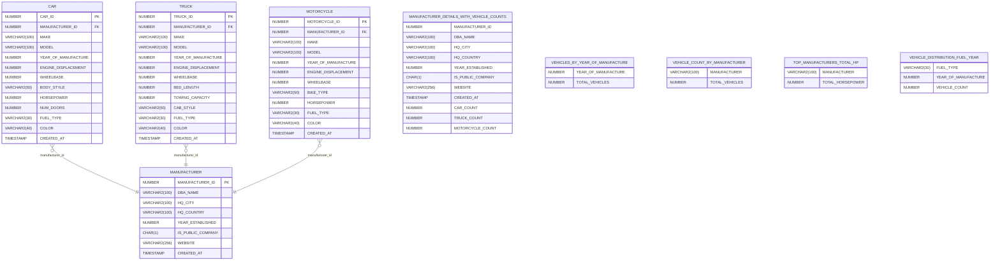

```mermaid
erDiagram
    CAR {
      NUMBER CAR_ID PK
      NUMBER MANUFACTURER_ID FK
      VARCHAR2(100) MAKE
      VARCHAR2(100) MODEL
      NUMBER YEAR_OF_MANUFACTURE
      NUMBER ENGINE_DISPLACEMENT
      NUMBER WHEELBASE
      VARCHAR2(50) BODY_STYLE
      NUMBER HORSEPOWER
      NUMBER NUM_DOORS
      VARCHAR2(30) FUEL_TYPE
      VARCHAR2(40) COLOR
      TIMESTAMP CREATED_AT
    }
    TRUCK {
      NUMBER TRUCK_ID PK
      NUMBER MANUFACTURER_ID FK
      VARCHAR2(100) MAKE
      VARCHAR2(100) MODEL
      NUMBER YEAR_OF_MANUFACTURE
      NUMBER ENGINE_DISPLACEMENT
      NUMBER WHEELBASE
      NUMBER BED_LENGTH
      NUMBER TOWING_CAPACITY
      VARCHAR2(50) CAB_STYLE
      VARCHAR2(30) FUEL_TYPE
      VARCHAR2(40) COLOR
      TIMESTAMP CREATED_AT
    }
    MOTORCYCLE {
      NUMBER MOTORCYCLE_ID PK
      NUMBER MANUFACTURER_ID FK
      VARCHAR2(100) MAKE
      VARCHAR2(100) MODEL
      NUMBER YEAR_OF_MANUFACTURE
      NUMBER ENGINE_DISPLACEMENT
      NUMBER WHEELBASE
      VARCHAR2(50) BIKE_TYPE
      NUMBER HORSEPOWER
      VARCHAR2(30) FUEL_TYPE
      VARCHAR2(40) COLOR
      TIMESTAMP CREATED_AT
    }
    MANUFACTURER {
      NUMBER MANUFACTURER_ID PK
      VARCHAR2(100) DBA_NAME
      VARCHAR2(100) HQ_CITY
      VARCHAR2(100) HQ_COUNTRY
      NUMBER YEAR_ESTABLISHED
      CHAR(1) IS_PUBLIC_COMPANY
      VARCHAR2(256) WEBSITE
      TIMESTAMP CREATED_AT
    }

    %% RELATIONSHIPS
    CAR }o--|| MANUFACTURER : "manufacturer_id"
    TRUCK }o--|| MANUFACTURER : "manufacturer_id"
    MOTORCYCLE }o--|| MANUFACTURER : "manufacturer_id"

    %% VIEWS (no direct relationships, but show column makeup)
    MANUFACTURER_DETAILS_WITH_VEHICLE_COUNTS {
      NUMBER MANUFACTURER_ID
      VARCHAR2(100) DBA_NAME
      VARCHAR2(100) HQ_CITY
      VARCHAR2(100) HQ_COUNTRY
      NUMBER YEAR_ESTABLISHED
      CHAR(1) IS_PUBLIC_COMPANY
      VARCHAR2(256) WEBSITE
      TIMESTAMP CREATED_AT
      NUMBER CAR_COUNT
      NUMBER TRUCK_COUNT
      NUMBER MOTORCYCLE_COUNT
    }
    VEHICLES_BY_YEAR_OF_MANUFACTURE {
      NUMBER YEAR_OF_MANUFACTURE
      NUMBER TOTAL_VEHICLES
    }
    VEHICLE_COUNT_BY_MANUFACTURER {
      VARCHAR2(100) MANUFACTURER
      NUMBER TOTAL_VEHICLES
    }
    TOP_MANUFACTURERS_TOTAL_HP {
      VARCHAR2(100) MANUFACTURER
      NUMBER TOTAL_HORSEPOWER
    }
    VEHICLE_DISTRIBUTION_FUEL_YEAR {
      VARCHAR2(30) FUEL_TYPE
      NUMBER YEAR_OF_MANUFACTURE
      NUMBER VEHICLE_COUNT
    }
```